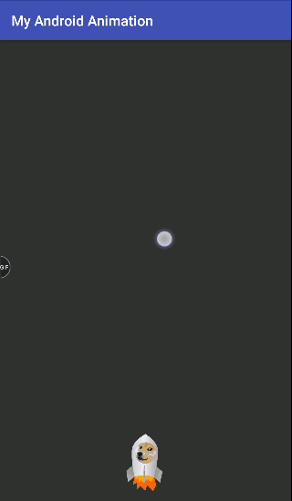

# Example Android Animations
Animating views using ValueAnimator and ObjectAnimator classes.

### Animations:

#### Launch a rocket 

#### Spin a rocket

#### Accelerate a rocket

#### Animate background color

#### Launch and spin using AnimatorSet or ViewPropertyAnimator

#### Don't leave Doge behind (Animating two objects)

#### Animation events

#### Fly there and back (Animating options)

#### Jump and blink (Animations in XML)

Credits: [Raywenderlich](https://www.raywenderlich.com)
